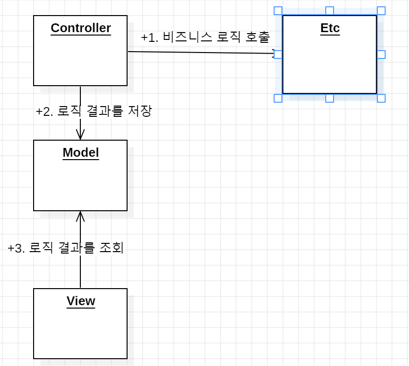

서블릿, JSP, MVC 패턴 
==

## MVC 패턴
기존 서블릿과, JSP에서는 UI, 비즈니스 로직 관련 코드가 한 군데에 집중돼 있어, 유지 보수 관점에서 좋지 않았다.

역할을 분리하여 해당 문제를 해결하는 패턴을 MVC 패턴이라고 한다. 각각의 영역을 **컨트롤러**, **모델**, **뷰**라 한다.

**MVC 패턴의 구성 요소
- **컨트롤러(Controller)** : HTTP 요청을 검증하고, 비즈니스 로직을 실행하는 역할을 담당한다. 해당 결과를 Model에 담는 역할
- **모델(Model)** : 뷰에서 사용할 데이터를 전달해주는 역할을 담당한다.
- **뷰(View)** : 모델에 담겨있는 데이터를 사용해서 화면을 그리는 일에 집중. HTML을 생성



서블릿을 컨트롤러로, 모델을 HttpServletRequest의 저장소 기능을 사용하고, JSP로 View를 구현할 수 있다. 

#### redirect vs forward
- redirect는 실제 클라이언트에 응답이 나갔다가 클라이언트가 redirect 경로로 다시 요청
- forward는 서버 내부 호출이기 때문에, 클라이언트가 인지를 하지 못한다.
- 그래서, dispatcher.forward(request, response)를 호출했을 때, 클라이언트의 URL은 변경되지 않는다


### 한계점
- 컨트롤러에서 공통적으로 포워드하는 로직이 중복된다.
```java
RequestDispatcher dispatcher = request.getRequestDispatcher(viewPath);
dispatcher.forward(request, response);
```
- 포워드하는 로직처럼 공통적으로 처리해야하는 로직을 처리하는것이 어렵다.

즉, 공통 처리가 어렵다는 한계점이 존재한다. 
서블릿 코드를 실행하기 이전에 공통 처리 로직을 수행하는 역할을 담당하는 코드가 필요하다. 


