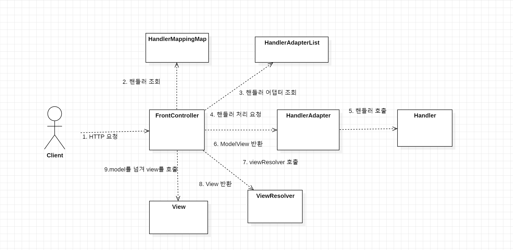
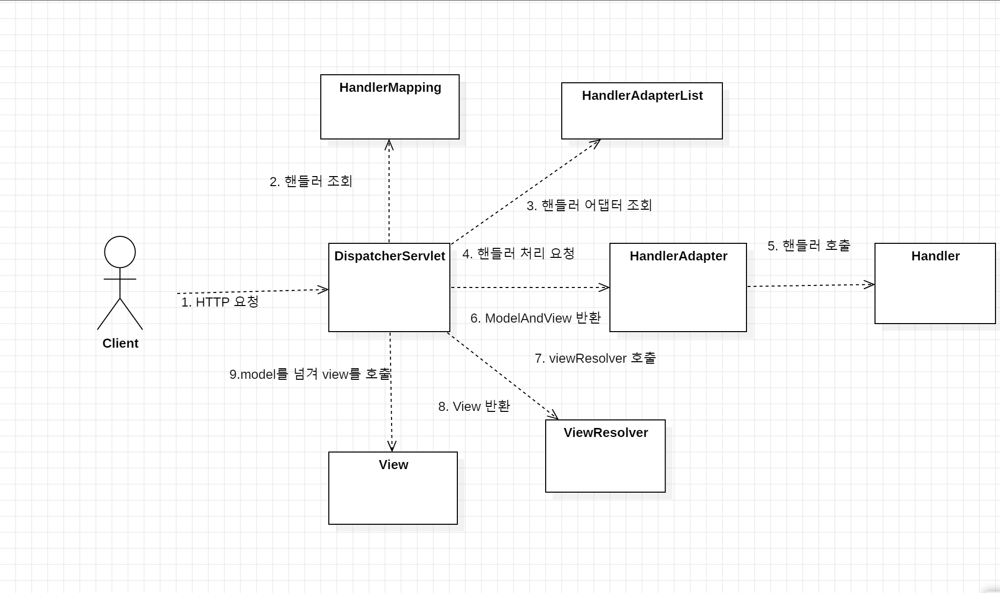

스프링 MVC - 구조
==

## 스프링 MVC 전체 구조

**MVC 프레임워크 구조**

**스프링 MVC 프레임워크 구조**

**동작 순서**
1. 핸들러 조회: 핸들러 매핑을 통해 요청 URL에 매핑된 컨트롤러를 조회한다.
2. 핸들러 어댑터 조회: 핸들러를 실행할 수 있는 어댑터를 조회
3. 어댑터 실행: 어댑터를 실행
4. 핸들러 실행: 어댑터가 핸들러를 실행
5. ModelAndView 반환: 어댑터가 핸들러의 정보를 이용해서 ModelAndView를 반환한다.
6. viewResolver 호출: 뷰 리졸버를 찾고, 실행
7. View 반환: 뷰 리졸버가 논리적인 이름을 물리적인 이름으로 바꾼다.
8. 뷰 렌더링: 렌더링한다.

## DispatcherServlet
- 스프링 MVC도 프론트 컨트롤러 패턴으로 구현돼있다.
- 이 컨트롤러가 DispatcherServlet
- DispatcherServlet이 스프링 MVC의 핵심

**서블릿 등록**
- DispatcherServlet도 HttpServlet을 상속 받아서 사용한다.
- 스프링 부트가 자동으로 등록한다. 
- DispatcherServlet은 모든 경로에 대해서 매핑한다.

**요청 흐름**
- 요청이 오면, service() 메서드가 호출된다.
- service()를 시작으로 doDispatch()가 호출된다.

## 핸들러 매핑, 핸들러 어댑터
@Controller가 아닌, 과거에는 인터페이스를 구현해서 ModelAndView를 반환해야했다.  
- 이전에는 스프링 빈의 이름으로 핸들러를 찾아서 요청이 오면 이를 실행했다.
  - 스프링 빈의 이름으로 핸들러를 찾을 수 있는 핸들러 매핑과 이를 실행할 수 있는 핸들러 어댑터가 필요했다는 것이다.
  
**자동으로 등록하는 핸들러 매핑, 어댑터**
#### HandlerMapping(우선순위 나열)
0. `RequestMappingHandlerMapping`: 애노테이션 기반의 컨트롤러에서 @RequestMapping으로 등록된 메서드를 실행할 때 사용
1. `BeanNameUrlHandlerMapping`: 스프링 빈의 이름으로 핸들러를 찾는다.

#### HandlerAdapter(우선순위 나열)
0. `RequestMappingHandlerAdapter`: 애노테이션 기반의 컨트롤러에서 @RequestMapping으로 등록된 메서드를 실행할 때 사용
1. `HttpRequestHandlerAdapter`: HttpRequestHandler 처리
2. `SimpleControllerHandlerAdapter`: Controller 인터페이스를 처리

**빈의 이름이 URL이고 Controller 인터페이스를 구현한 스프링 빈을 처리할 때**
1. 요청 URL을 기반으로 HandlerMapping을 순서대로 조회, 핸들러를 찾는다.
2. 빈 이름으로 핸들러를 찾아주는 `BeanNameUrlHandlerMapping`이 반환된다.
3. 이후, 핸들러 어댑터를 조회한다.
4. Controller 인터페이스를 구현한 빈이므로, `SimpleControllerHandlerAdapter`가 반환된다.
5. 핸들러 어댑터를 실행하면서, 핸들러 정보를 넘겨주고 이를 실행시킨다.

**HttpRequestHandler의 구현체일 경우**
1. 요청 URL을 기반으로 HandlerMapping을 순서대로 조회, 핸들러를 찾는다.
2. 빈 이름으로 핸들러를 찾아주는 `BeanNameUrlHandlerMapping`이 반환된다.
3. 이후, 핸들러 어댑터를 조회한다.
4. HttpRequestHadnler 인터페이스를 구현한 빈이므로, `HttpRequestHandlerAdapter`가 반환된다.
5. 핸들러 어댑터를 실행하면서, 핸들러 정보를 넘겨주고 이를 실행시킨다.

현재는 `@RequestMapping`을 처리하는 핸들러 매핑, 어댑터를 사용한다.

## ViewResolver
어댑터가 ModelAndView를 반환한 이후, viewResolver를 통해 View를 생성한다.

스프링은 `InternalResourceViewResolver`라는 viewResolver를 자동으로 등록한다.

어플리케이션 설정 정보를 통해, prefix, suffix를 지정한 후, ModelAndView의 논리적인 리소스 이름을 가지고 View를 반환하는 역할을 수행한다.

**자동으로 등록되는 뷰 리졸버**
1. `BeanNameViewResolver`: 빈 이름으로 뷰를 찾아서 반환
2. `InternalResourceViewResolver`: JSP를 처리할 수 있는 View를 반환 

**뷰 리졸버 동작 순서**
1. 핸들러 어댑터를 통해 논리적인 뷰 이름을 획득한다.
2. 논리적인 뷰이름으로 ViewResolver를 순서대로 호출한다.
3. `BeanNameViewResolver`를 먼저 호출하는데, 스프링 빈으로 등록된 빈이 없다.
4. `InternalResourceViewResolver`가 호출된다.
5. `InternalResourceViewResolver`는 `InternalResourceView`를 반환한다.
6. `InternalResourceView`는 JSP로 렌더링 할 수 있는 기능을 가지고 있다.

## 스프링 MVC
기존 인터페이스 방식이 아닌 @RequestMapping 애노테이션을 활용한 컨트롤러를 사용하는 것으로 굉장히 유연한 컨트롤러를 만들 수 있게 됐다.
- 핸들러 매핑으로 `RequestMappingHandlerMapping`을 사용한다.
- 핸들러 어댑터로 `RequestMappingHandlerAdapter`을 사용한다.

이 둘은, 가장 높은 우선순위를 갖는다.

- `@Controller`:
  - 스프링이 자동으로 스프링 빈으로 등록하고, 스프링 MVC에서 애노테이션 기반 컨트롤러로 인식한다.
- `@RequestMapping`
  - 요청 정보를 매핑한다. 해당 URL이 호출되면 적용된 메서드를 호출한다.
  - 클래스 레벨, 메서드 레벨에 적용 가능하다.
- `ModelAndView`
  - 모델과 뷰 정보를 담아서 반환하면 된다.

`ModelAndView`를 생성해서 반환하는 중복을 해결하기 위해, 논리적인 뷰 이름을 반환해도 정상적으로 렌더링이 된다.

